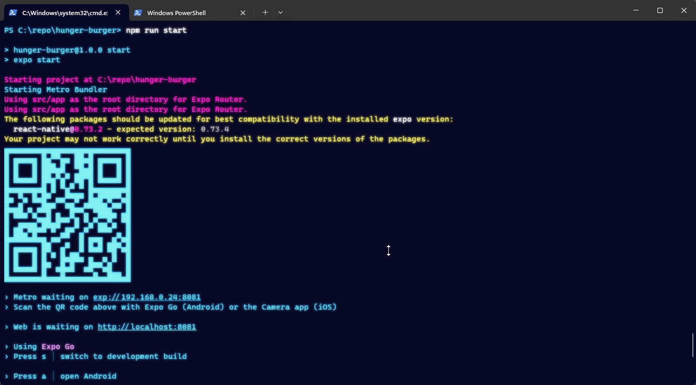

<h1 align="center">
    Hunger Burger 🍔
</h1>

<p align="center">
  <a href="#technologies">Technologies</a>&nbsp;&nbsp;&nbsp;|&nbsp;&nbsp;&nbsp;
  <a href="#-layout">Getting started</a>&nbsp;&nbsp;&nbsp;|&nbsp;&nbsp;&nbsp;
  <a href="#-project">Project</a>&nbsp;&nbsp;&nbsp;|&nbsp;&nbsp;&nbsp;
  <a href="#-license">License</a>
</p>

<p align="center">
  
</p>

<br>

<p align="center">
  
</p>

---

## 💻 Project

Tame your Hunger with the best Burger! 🍔🥤

This is a project developed during the **[Next Level Week Expert](https://nextlevelweek.com/)**, presented by **[@Rocketseat](https://github.com/Rocketseat)** during February 5-8, 2024.


## 🤖 Technologies

This project was developed using the following technologies:

- [React Native](https://reactnative.dev/)
- [Expo](https://expo.io/)
- [TypeScript](https://www.typescriptlang.org/)
- [Tailwind](https://tailwindcss.com)


## 🚀 Getting started

Clone the project and access the folder

```bash
$ git clone https://github.com/thegfmachado/hunger-burger.git

$ cd hunger-burger
```

Follow the steps below
```bash
# Install the dependencies
$ npm i install

# Start the project
$ npm run start
```

Put your phone number [here](https://github.com/thegfmachado/hunger-burger/blob/main/src/app/cart.tsx#L16) and save file

Install expo go on your device app store

[Play store](https://play.google.com/store/apps/details?id=host.exp.exponent&hl=pt_BR&gl=US&pli=1)

[App store](https://apps.apple.com/br/app/expo-go/id982107779)

Open the expo go and scan the QR code on your terminal

<p align="center">
  
</p>


## 📝 License

This project is licensed under the MIT License. See the [LICENSE](LICENSE.md) file for details.

---

Made with 💜 by [gfm](https://github.com/thegfmachado) 👋
